# Favio Solorzano Cardenas 

# Sportify API

API REST para gestionar equipos deportivos y sus jugadores.

---

## Descripción

Esta API permite crear, editar, eliminar y buscar equipos de fútbol y sus jugadores.
Cada jugador pertenece a un equipo.

---

## Tecnologías usadas

- Python 3.14
- Django 6.0
- Django REST Framework 3.17
- SQLite

---

## Cómo ejecutar el proyecto

1. Clonar el repositorio
2. Activar el entorno virtual: `venv\Scripts\activate`
3. Instalar dependencias: `pip install -r requirements.txt`
4. Aplicar migraciones: `python manage.py migrate`
5. Correr el servidor: `python manage.py runserver`

---

## Endpoints

### Equipos

| Método | URL | Descripción |
|--------|-----|-------------|
| GET | /api/teams/ | Listar equipos |
| POST | /api/teams/ | Crear equipo |
| PUT | /api/teams/{id}/ | Editar equipo |
| DELETE | /api/teams/{id}/ | Eliminar equipo |
| GET | /api/teams/?search= | Buscar equipo |

### Jugadores

| Método | URL | Descripción |
|--------|-----|-------------|
| GET | /api/players/ | Listar jugadores |
| POST | /api/players/ | Crear jugador |
| PUT | /api/players/{id}/ | Editar jugador |
| DELETE | /api/players/{id}/ | Eliminar jugador |

---

## Pruebas

Las pruebas se realizaron con Thunder Client (VS Code).

### Método: POST URL: http://127.0.0.1:8000/api/teams/

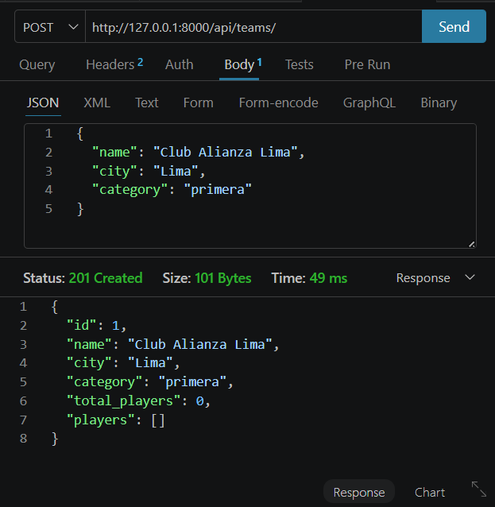

### Método: GET URL: http://127.0.0.1:8000/api/teams/

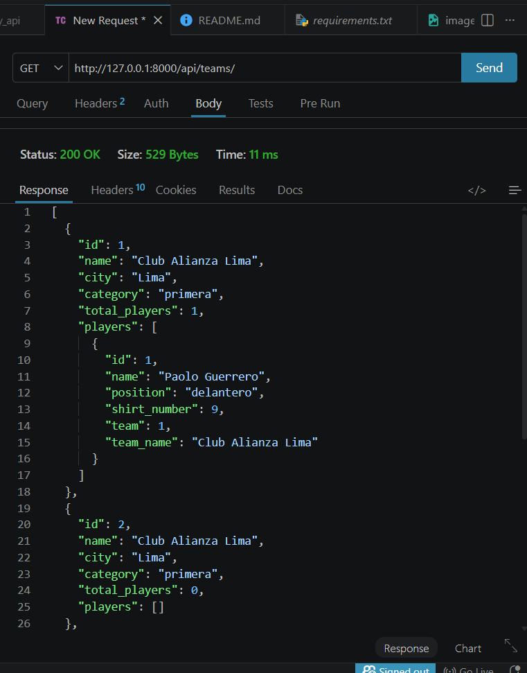

### Método: PUT URL: http://127.0.0.1:8000/api/teams/1/

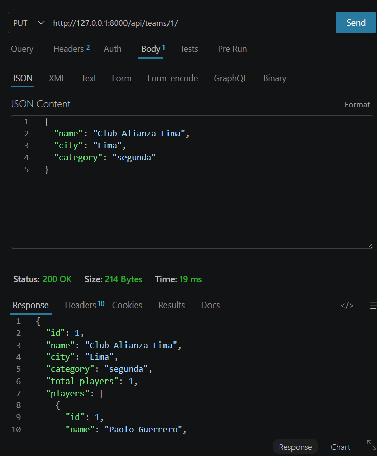

### Método: PATCH URL: http://127.0.0.1:8000/api/teams/1/

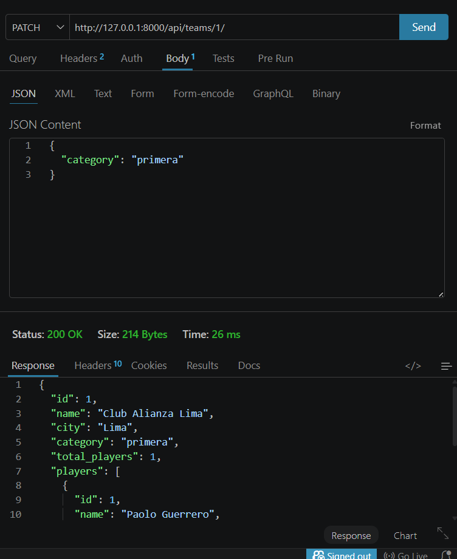

### Método: GET URL: http://127.0.0.1:8000/api/teams/?search=Lima

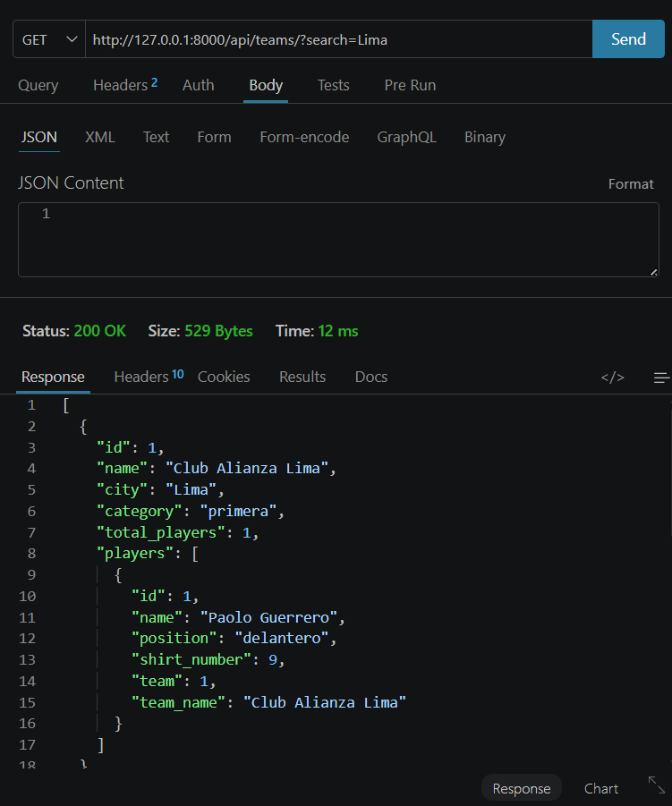

### Método: GET URL: http://127.0.0.1:8000/api/teams/?search=segunda

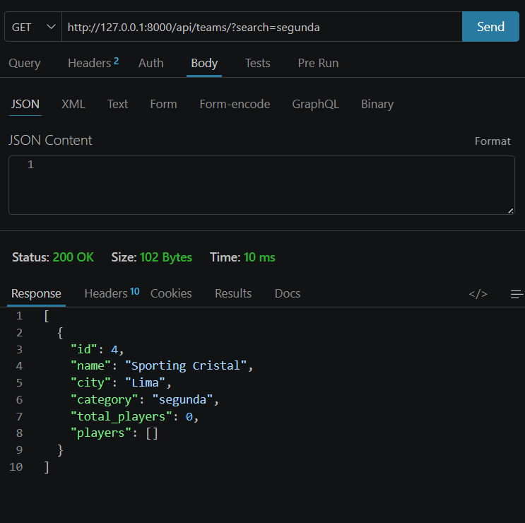

### Método: DELETE URL: http://127.0.0.1:8000/api/teams/3/

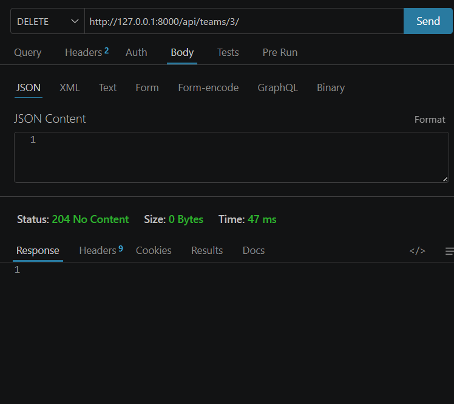

### Método: POST URL: http://127.0.0.1:8000/api/players/

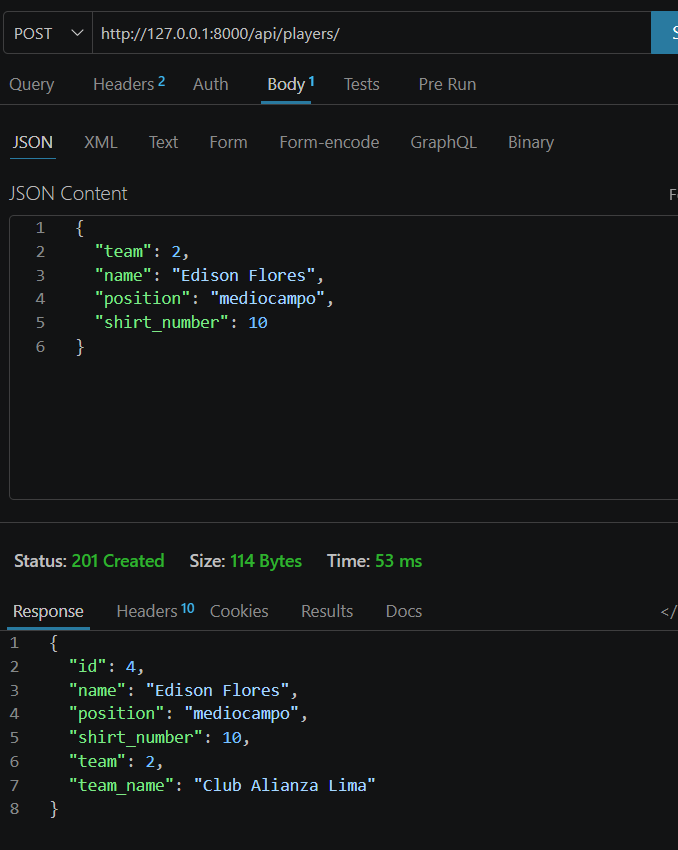

### Método: GET URL: http://127.0.0.1:8000/api/players/

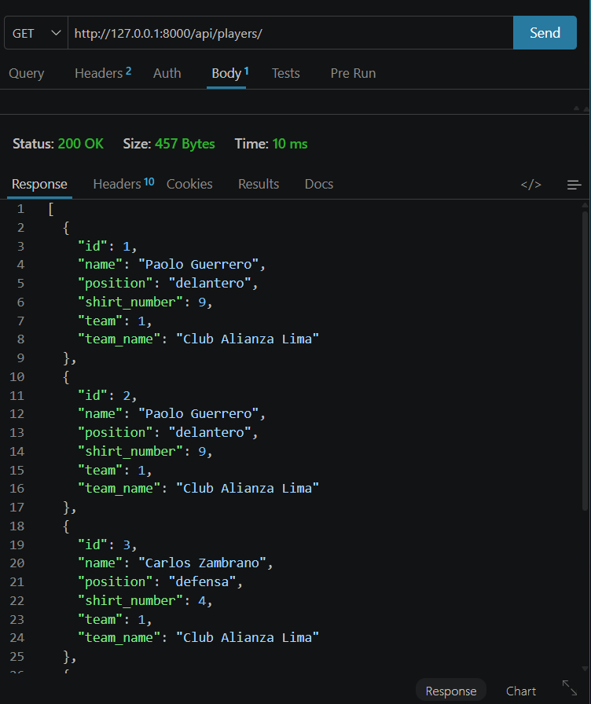

### Método: GET URL: http://127.0.0.1:8000/api/teams/1/

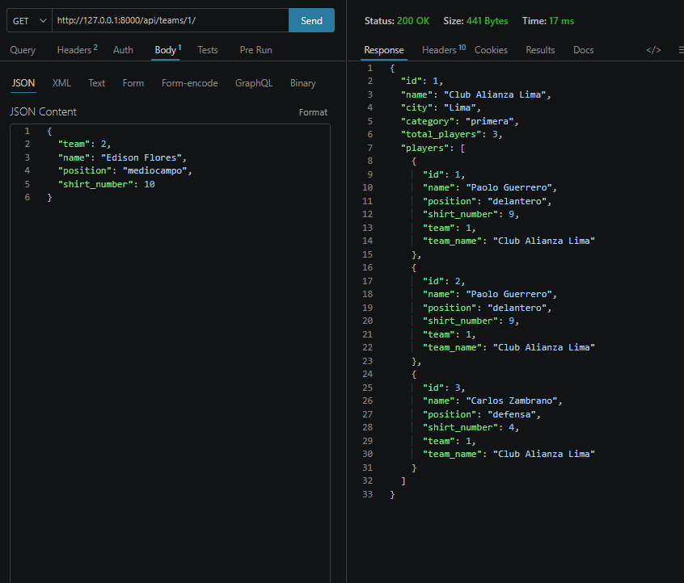

### Método: PUT URL: http://127.0.0.1:8000/api/players/1/

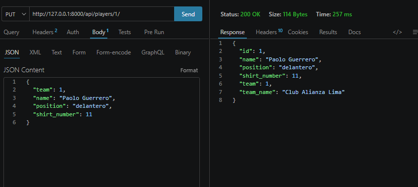

### Método: GET URL: http://127.0.0.1:8000/api/players/?search=delantero

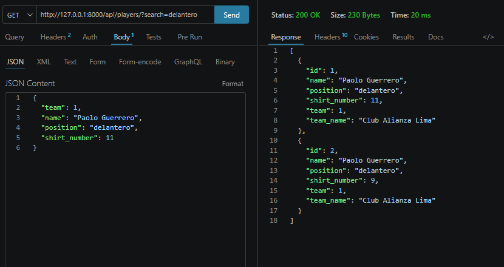

